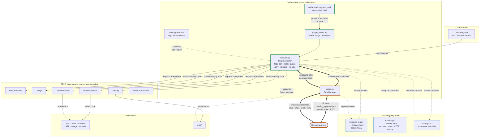

# Architecture Overview

**System:** Agentic SDLC Orchestrator, demonstrated by building and evolving a URL shortener.

**Read this first.** There are two layers in this repository and conflating them is the single
easiest way to misread the work:

- **The orchestrator** (`orchestrator/`, `docs/orchestration-graph.yaml`) is **the deliverable**.
  It is a dependency-graph execution engine with gates, retries, rollback, lineage and metrics.
- **The URL shortener** (`src/`) is **the test subject**. It is the software the orchestrator
  builds and modifies. It must be genuinely good code — but it is the *evidence*, not the
  product.

If you only inspect one thing, inspect `docs/orchestration-graph.yaml` and
`orchestrator`'s `exec.GraphExecutor` (Java, per DEC-0012 — the diagram below
predates the language port and is left as-is per that decision; the modules it
names now live under `src/main/java/com/sdlc/orchestrator/`, see
`orchestrator/README.md` for the current file-to-class mapping).

> **Status note.** This document describes a design that is **specified and scaffolded**, not
> yet fully implemented. Files under `orchestrator/` are structurally complete skeletons —
> real dataclasses, real signatures, real control flow — with implementation bodies marked
> `TODO(impl)`. Nothing in this document should be read as a claim that the system currently
> runs end to end. `orchestrator/README.md` states precisely what is skeleton and what is done.

---

## 1. Design principles

Five principles, each traceable to a decision in `docs/decision-log.md`:

1. **The graph is data, not code.** The SDLC dependency graph lives in YAML and is inspectable,
   diffable and reviewable *before* anything executes. A graph that only exists once Python has
   run cannot be audited in advance.
2. **Governance is declarative.** Retry policies, rollback actions, gates and re-plan triggers
   are fields on a node — not `if` statements buried in the executor. You can read the
   governance off the graph.
3. **Gates must be provable, not asserted.** A human gate writes a file, stops the process, and
   resumes from persisted state. You can inspect it, kill the machine, and resume (DEC-0007).
4. **Lineage is append-only.** Decisions are evidence. Evidence that can be rewritten is not
   evidence (DEC-0005).
5. **Own the critical component.** The orchestrator is hand-built so every line is defensible
   (DEC-0003). Patterns are borrowed and attributed; dependencies are not.

---

## 2. Component overview



**Reading the diagram.** Three flows are deliberately drawn distinctly:

- **Solid arrows** — the normal execution path: CLI → executor → stage agents → the codebase.
- **Thick arrows (①–④)** — the **gate/approval path**. Note that it *leaves the process*: the
  executor stops at ②, and ③ happens outside any running program. This is the persist-and-exit
  model, and it is why the gate is provable rather than asserted.
- **Dashed arrows** — the **observability path**, which is write-only from the executor's
  perspective, with one exception: `state.json` is read back on resume, which is what makes
  pausing survivable.

---

## 3. The orchestration model

### 3.1 Nodes

A node is one SDLC stage. It carries: an `id`, `depends_on` edges, an **entry gate**
(precondition for starting), an **exit gate** (validation of output), an optional
**human approval** flag, a **retry policy**, a **rollback action**, and **re-plan triggers**.

Nodes **produce artifacts**. This matters: modelling a node as "produces X" rather than "does
X" is what makes staleness computable (§3.6), a pattern borrowed from Dagster's
software-defined assets.

### 3.2 The node state machine

```
                   ┌────────────────────────────────────────┐
                   │                                        │
PENDING ──▶ READY ──▶ RUNNING ──▶ COMPLETED                 │
   ▲          │          │                                  │
   │          │          ├──▶ FAILED ──▶ RETRYING ──────────┘
   │          │          │                  │  (attempts < max)
   │          │          │                  └──▶ ROLLED_BACK ──▶ (safe-stop)
   │          │          │
   │          └──▶ BLOCKED_ON_GATE ──▶ (resume) ──▶ RUNNING
   │
   └── STALE ◀── upstream artifact changed (re-plan)
```

| State | Meaning |
|---|---|
| `PENDING` | Dependencies not yet satisfied |
| `READY` | All dependencies `COMPLETED`; eligible to dispatch |
| `RUNNING` | Stage agent executing |
| `BLOCKED_ON_GATE` | Awaiting human approval; **run state persisted, process may exit** |
| `FAILED` | Attempt failed; retry eligibility not yet evaluated |
| `RETRYING` | Failed with attempts remaining; backoff in progress |
| `ROLLED_BACK` | Retries exhausted; compensating action executed |
| `COMPLETED` | Succeeded **and passed its exit gate** |
| `STALE` | Was `COMPLETED`, but an upstream artifact changed; must re-run |

Two states deserve comment. `BLOCKED_ON_GATE` is a **first-class state**, not a boolean —
following Airflow, which models human waiting as a real task state (`awaiting_input`). And
`COMPLETED` means *passed its exit gate*, not merely "the agent returned" — without that,
completion would mean only that an LLM produced text.

### 3.3 Entry and exit gates

Two different mechanisms, often conflated:

- **Entry gate** — a precondition on *starting*. "Do the inputs I need exist?" Prevents a node
  running against missing or malformed input.
- **Exit gate** — a validation predicate on *output*. "Does what I produced meet the bar?"
  A failed exit gate means the node **has not completed**, and it re-runs under its retry
  policy.

**The exit gate is the critic layer expressed as data.** Agent research consistently finds that
separating generation from evaluation beats asking one model call to do both — a generator
grading itself is systematically generous. Here the generator is the stage agent and the critic
is a declared, machine-checkable condition in the YAML. It runs identically every time and is
visible without reading code.

A third, orthogonal mechanism is the **human approval gate** (`requires_human_approval`), which
is a *policy* control rather than a *correctness* control — see §4.

### 3.4 Sequential and parallel execution

Execution order comes from **Kahn's algorithm**. Compute in-degrees, seed a queue with
in-degree-0 nodes, pop and emit, decrement successors, enqueue new zeros.

Two properties of that choice do real work:

- **Cycle detection is free.** If fewer nodes are emitted than exist, the remainder sit in or
  behind a cycle → reject at load time.
- **The frontier *is* the parallelism.** Every node simultaneously at in-degree 0 is mutually
  independent by construction. We therefore **derive** parallelism from the edges rather than
  trusting a declaration (DEC-0011); `can_run_parallel` in the YAML is a *checked assertion*,
  and a mismatch is a load-time error.

The graph's concrete parallel section: **testing** and **documentation** fan out from
implementation and run concurrently; **release readiness** is the **join barrier** requiring
both. The join is all-success: if either branch fails terminally, release readiness must not
fire — it inherits `upstream_failed` rather than proceeding on partial input.

> **Concurrency implementation note (DEC-0013, supersedes DEC-0004).** The frontier
> described here is dispatched onto **virtual threads**, not `asyncio` — the
> original design's single-threaded-event-loop reasoning does not survive the port
> to Java, because virtual threads are genuinely concurrent. See DEC-0013 for the
> replacement guarantees (a single lock around `Run` mutation, a serialized lineage
> appender, and immutable node inputs/outputs).

### 3.5 Bounded retry is not a cycle

The graph is acyclic and must stay so. A bounded retry does not violate that:

- A cycle is an **edge in the dependency graph**; a retry is **repeated execution of one node**,
  adding no edge.
- A cycle has no termination argument; a retry has a monotonically increasing attempt counter
  and a `max_attempts` ceiling — a termination proof.
- Formally, retry is a **self-loop in the node's internal state machine**
  (`RUNNING → FAILED → RETRYING → RUNNING`), not an edge in the inter-node DAG.

Cycle detection therefore runs over the **edge set only** and never encounters retry. The two
live in different structures. The same argument covers re-planning: `STALE` re-execution
traverses existing edges and adds none.

### 3.6 Dynamic re-planning

When an upstream node's artifact changes, downstream work is no longer trustworthy. Re-planning
is a **staleness problem, not a restart problem** (Dagster's model):

1. Compute the **transitive closure of descendants** of the changed node.
2. Intersect with each node's declared `re_plan_triggers` — not every downstream node cares
   about every upstream change.
3. Mark the affected set `STALE`; they return to the ready-queue when their dependencies settle.
4. **Unaffected nodes keep both their state and their recorded lineage.**

Point 4 is the governance requirement: re-planning must not erase history. An approval granted
for an artifact that did not change remains valid; an approval for an artifact that *did*
change is invalidated, because approval is bound to the specific artifact version it approved
(§4.2).

### 3.7 The failure ladder

Borrowed from Step Functions' documented `Retry`-then-`Catch` ordering, plus Temporal's
Saga-style compensation:

```
node fails
   │
   ├─▶ is the error non-retryable?  ──yes──▶ skip to rollback
   │        │ no
   ├─▶ attempts remaining?  ──yes──▶ RETRYING (exponential backoff) ──▶ re-run
   │        │ no
   ├─▶ rollback_action defined?  ──yes──▶ execute compensation ──▶ ROLLED_BACK
   │        │ no
   └─▶ SAFE-STOP: halt the run, persist state, surface to human
```

**Safe-stop** is the terminal fallback and is deliberately *not* "keep going without it." The
run halts with full state persisted and the failure surfaced, because continuing past an
unrecoverable stage would produce a release-readiness verdict based on work that did not happen.

**Retry policy schema** (Temporal's five fields): `max_attempts`, `initial_interval_seconds`,
`backoff_coefficient`, `max_interval_seconds`, `non_retryable_errors`. The last encodes the
transient-vs-permanent taxonomy declaratively: a validation error will not become valid by
being retried, so retrying it burns time and hides the real problem.

---

## 4. Policy guardrails and controlled autonomy

### 4.1 What requires a human

An action is **high-impact** and requires approval if it meets **any** of (DEC-0006):

1. **Irreversible** — cannot be automatically undone.
2. **Schema/data-shape change** — any DDL or migration.
3. **Deletion** — of any file, table, record or artifact.
4. **Release readiness** — any assertion that software is fit to ship.
5. **Production/config surface** — prod config, secrets, credentials, network exposure,
   trust-boundary-widening dependencies.

Everything else is **pre-approved**: reading code, writing new code and tests, running tests in
a sandbox, generating documentation, producing analyses.

The tiering is the point. Gating everything produces approval fatigue, and a human who
rubber-stamps every gate provides governance theatre. The criteria are **structural** rather
than judgement-based, so classification is reproducible — and deliberately *not* delegated to
the LLM, since a policy the agent can reason its way out of is not a policy.

Evidence that the policy tracks real risk: the greenfield graph has **2** human gates; the
brownfield graph has **3**, the extra one being the analytics migration.

### 4.2 The approval record

An approval is a structured artifact, not a log line:

| Field | Why |
|---|---|
| `approver` | who is accountable |
| `decided_at` | when |
| `decision` | `approved` / `rejected` / `approved_with_conditions` |
| `comment` | rationale — the *why*, which is the audit-relevant part |
| `artifact_ref` | **which exact artifact version was approved** |

`artifact_ref` is the field most often omitted and the most important: approving "the design"
is meaningless unless it names *which* design. Binding approval to an artifact hash means a
later change to that artifact invalidates the approval rather than silently inheriting it.

### 4.3 Autonomy boundary summary

| Agents may, unsupervised | Agents must stop for a human |
|---|---|
| Read any code or artifact | Run a schema migration |
| Write new code in `src/` | Delete any file, table or record |
| Write and run tests in a sandbox | Declare release readiness |
| Generate documentation | Touch production config or secrets |
| Produce analyses and plans | Take any irreversible action |
| Retry a failed step within policy | Exceed the retry budget (→ safe-stop) |

---

## 5. Observability and metrics

### 5.1 Correlation

Every event carries a `run_id`; node-level events add `node_id` and `attempt`. This triple
mirrors the **W3C Trace Context** shape (`trace_id` ≈ run, `span_id` ≈ node-attempt, with
parent linkage for causality) without adopting HTTP propagation, since we are single-process.
Adopting the shape now makes a later move to real OpenTelemetry a mapping exercise rather than
a redesign.

### 5.2 Audit trail vs. application log

Different artifacts, different rules — conflating them is a common design error:

| | Application log | Decision lineage |
|---|---|---|
| Answers | what the system did | **why** it was decided, and by whom |
| Mutability | rotatable, disposable | **append-only, never edited** |
| Audience | debugging engineer | reviewer, auditor, next session |

`lineage.jsonl` and `docs/decision-log.md` are the right-hand column. A superseded decision is
corrected by **appending an entry that references the old one**, never by rewriting.

### 5.3 The four required metrics — defined precisely

**Success rate.** `nodes_completed / nodes_attempted` per run; `runs_completed / runs_started`
cumulatively. Nodes that never became ready because an upstream branch failed are counted as
`upstream_failed`, **not** as failures of that node — counting them would multiply one root
cause into several and make the metric lie.

**Retry / rollback frequency.** `total_retry_attempts / nodes_attempted` and
`rollbacks_executed / nodes_attempted`. Rates, not counts, so runs of different sizes stay
comparable. Rising retry rate with flat success rate is the signature of a flaky dependency —
the system still works, but is working harder, which is exactly what should surface before it
becomes an outage.

**MTTR — and which one.** "MTTR" is genuinely four metrics (time to *repair*, *recovery*,
*resolve*, *respond*) with different clock starts. We use **mean time to recovery**: clock
starts when a node first enters `FAILED`, stops when that node reaches `COMPLETED` via retry or
its rollback completes. Mean over all failure episodes in a run. Rationale: it is the only one
of the four fully observable from inside the orchestrator — we cannot see human detection time
or long-term preventative fixes. Naming which MTTR is part of the metric's definition, not a
footnote.

**End-to-end latency.** Wall-clock from run start to terminal state, reported **with a
breakdown**: time `RUNNING` (real work), `BLOCKED_ON_GATE` (human wait), `RETRYING` (backoff).
One number would hide the story — human wait can dominate, and is not a system performance
problem. Merging them would make the orchestrator look slow because someone went to lunch.

Per SRE guidance, distributions beat averages. With few nodes per run, percentiles are noisy,
so we record **per-node durations** and report `p50`/`max` cumulatively once enough runs exist,
rather than computing a p99 from six samples and pretending it means something.

### 5.4 Critical path as the latency baseline

The graph's **critical path** (longest weighted path, computed by relaxing edges in topological
order, O(V+E)) gives the *expected* floor on end-to-end latency. Comparing it to *measured*
latency turns a bare number into a signal: a large gap indicates unexpected serialisation, gate
wait, or retries.

---

## 6. Roles

Every graph node is executed by a role. Roles are defined by **what gets them rejected**, not
just what they produce — an exit criterion that cannot fail is not a criterion.

### 6.1 Requirements Agent

- **Responsibility.** Interpret intent; surface ambiguity; normalise into a clear engineering
  problem with explicit assumptions and acceptance criteria.
- **Inputs.** Raw request; existing codebase context (brownfield); prior decision log.
- **Outputs.** Normalised requirement spec; **enumerated ambiguities** with proposed
  resolutions; acceptance criteria; explicit assumptions list.
- **Autonomy.** Full — analysis only, no side effects.
- **Rejected at exit gate if:** acceptance criteria are absent or untestable; an ambiguity is
  resolved silently instead of being named; the output restates the request without normalising
  it; assumptions are implied rather than listed. *(This gate is what makes the ambiguous
  scenario work — see `scenarios/ambiguous.md`, where it fires.)*

### 6.2 Design / Architecture Agent

- **Responsibility.** Turn the normalised requirement into a technical design: components, data
  model, API contracts, and — for brownfield — an **impact analysis** of affected modules,
  APIs and data flows.
- **Inputs.** Requirement spec; codebase structure; decision log.
- **Outputs.** Design document; API/schema definitions; impact analysis; **flagged high-impact
  actions** (which is how migrations get surfaced to the gate).
- **Autonomy.** Full for producing the design. **May not execute** any schema change it designs.
- **Rejected at exit gate if:** it fails to name every impacted module (brownfield); proposes a
  schema change without a migration *and* rollback plan; leaves API contracts unspecified;
  omits a high-impact flag for an action meeting the DEC-0006 criteria.

### 6.3 Implementation Agent

- **Responsibility.** Write production-quality code satisfying the design.
- **Inputs.** Design document; API/schema definitions; existing code.
- **Outputs.** Source code in `src/`; inline documentation; migration scripts (**written, not
  executed**).
- **Autonomy.** Full within `src/` — create and modify application code freely. **May not** run
  migrations, delete files, or alter production config.
- **Rejected at exit gate if:** code does not import/compile; the design's API contract is not
  honoured; a high-impact action was executed rather than staged for approval; secrets or
  credentials appear in source.

### 6.4 Testing Agent

- **Responsibility.** Write and execute unit and integration tests; report coverage and
  failures honestly.
- **Inputs.** Source code; acceptance criteria; design.
- **Outputs.** Test suite in `tests/`; execution results; coverage summary.
- **Autonomy.** Full — write and run tests in a sandbox freely.
- **Rejected at exit gate if:** tests do not actually execute; acceptance criteria are
  untested; **tests were weakened or deleted to make the suite pass** (the critical one —
  an agent that can edit the test to fit the code has no critic); coverage falls below the
  declared threshold.

### 6.5 Documentation Agent

- **Responsibility.** Produce accurate user- and developer-facing documentation.
- **Inputs.** Source code; API definitions; design; requirement spec.
- **Outputs.** README/API docs; setup instructions; updated architecture notes.
- **Autonomy.** Full — documentation is non-destructive.
- **Rejected at exit gate if:** documented endpoints do not exist in code (drift); setup
  instructions are untested or incomplete; a documented behaviour contradicts the implementation.

### 6.6 Release-Readiness Agent

- **Responsibility.** Assess whether the change is fit to ship: aggregate test results, check
  acceptance criteria, confirm docs exist, enumerate residual risks.
- **Inputs.** **All** upstream artifacts — this node is the join barrier.
- **Outputs.** Release-readiness report; go/no-go recommendation with rationale; residual risk
  list.
- **Autonomy.** **None for the decision.** It may produce a recommendation; it may never
  declare release readiness itself — criterion 4 of DEC-0006 makes this a mandatory human gate.
- **Rejected at exit gate if:** it recommends "go" with failing tests or unmet acceptance
  criteria; residual risks are unlisted; it asserts readiness rather than recommending it.

### 6.7 The Executor (a first-class role)

- **Responsibility.** Own graph traversal, state, gates, retries, rollback, lineage and metrics.
  It is the only component permitted to mutate run state.
- **Inputs.** Graph YAML; persisted run state; agent outputs; approval records.
- **Outputs.** State transitions; `state.json`; `lineage.jsonl`; `metrics.json`;
  `pending_approval.json`.
- **Autonomy.** Full over orchestration mechanics; **zero** over content — it never judges
  whether a design is good, only whether the declared exit gate passed.
- **Fails if:** it advances a node whose exit gate did not pass; loses lineage across a
  re-plan; proceeds past a human gate without a recorded decision; or exceeds a retry budget
  without reaching safe-stop.

### 6.8 The Human Approver (a first-class role)

- **Responsibility.** Own oversight, approvals and final quality. Accountable for every
  high-impact action.
- **Inputs.** `pending_approval.json`; the referenced artifact; upstream lineage.
- **Outputs.** An approval record (`approver`, `decided_at`, `decision`, `comment`,
  `artifact_ref`).
- **Authority.** May approve, reject, or approve with conditions; may halt a run at any point.
- **Deliberately not automatable.** An `--auto-approve` flag exists only for CI and must never
  be the default — a gate that approves itself is not a gate.

---

## 7. Risks and trade-offs

Stated as risks with mitigations, not as caveats.

| # | Risk | Impact | Mitigation / honest position |
|---|---|---|---|
| 1 | **Custom executor has no crash-durability mid-node** | A process killed while a node runs loses that node's progress | Accepted. Gates are the durable checkpoints; a lost node re-runs. Temporal solves this properly and we chose not to pay its cost (DEC-0003) |
| 2 | **SQLite single-writer** | Concurrent writes serialise; not production-scale | Accepted for a prototype. The storage layer is kept behind an interface so Postgres is a swap, not a rewrite |
| 3 | **LLM-driven nodes are non-deterministic** | The same graph can produce different artifacts across runs | Exit gates constrain *output shape and validity* rather than exact content; tests are the objective check. This is why the critic layer is machine-checkable rather than another LLM judging freely |
| 4 | **Exit gates can be gamed by a capable agent** | e.g. weakening tests until they pass | Explicit rejection criterion in §6.4; test-count and assertion-count deltas are checked. Genuinely only *mitigated*, not solved — noted as a limitation |
| 5 | **No cross-file transactionality** in persistence | A crash between lineage and state writes leaves brief inconsistency | Lineage is written first (an extra entry is harmless; a missing one is not); state reconstruction is tolerant |
| 6 | **Shortener is an open redirector by design** | Phishing/abuse vector | Scheme allowlist, internal-range denylist incl. `169.254.169.254`, resolved-IP validation, no redirect-following. Residual risk remains (DNS rebinding, reputation drift) and is stated rather than claimed solved |
| 7 | **302 costs an origin hit per click** | Higher load than a cached 301 | Deliberate: 301 would break click analytics *and* link revocation (DEC-0009). Mitigated with an in-process cache |
| 8 | **Approval fatigue** if gates multiply | Rubber-stamping = governance theatre | Risk-tiered policy (DEC-0006); 2 gates greenfield, 3 brownfield |
| 9 | **Graph/policy drift** — YAML flags disagreeing with policy code | Silent governance gap | Load-time validation compares declared `requires_human_approval` against the DEC-0006 classification and fails on mismatch |
| 10 | **Single-process concurrency ceiling** (virtual threads, DEC-0013 — supersedes the `asyncio` version of this risk under DEC-0004) | CPU-bound node work would not parallelise | None expected (workload is I/O-bound); unlike the superseded `asyncio` model, a blocking call inside a node does **not** stall sibling branches (no shared event loop to stall) — but `Run` mutation must go through `stateLock`, since virtual threads are genuinely concurrent and no longer give that atomicity for free |

---

## 8. Known limitations

Stated plainly, because the assignment grades honesty about them:

1. **Not yet fully implemented.** `orchestrator/` is a structurally complete skeleton with
   `TODO(impl)` bodies. This document specifies a design; it does not report a running system.
2. **No distributed execution.** Single process, single machine. Multi-worker execution would
   require real distributed state (this is the point at which adopting Temporal becomes correct).
3. **No authentication on the orchestrator itself.** The approval mechanism trusts whoever can
   write the approval file. Adequate for a local prototype; a real deployment needs
   authenticated, non-repudiable approvals.
4. **Metrics are per-run with a thin cumulative roll-up.** No time-series backend, no
   percentiles worth trusting until enough runs exist.
5. **Agent quality is model-dependent.** Exit gates catch structural failures, not subtle
   design mistakes. A human still owns final quality — which is the stated principle, not a
   workaround.
6. **The three scenarios share one graph shape.** Brownfield and ambiguous differ by node
   subset, re-plan behaviour and gate count — genuinely different traversals, but not different
   graph *topologies*.
